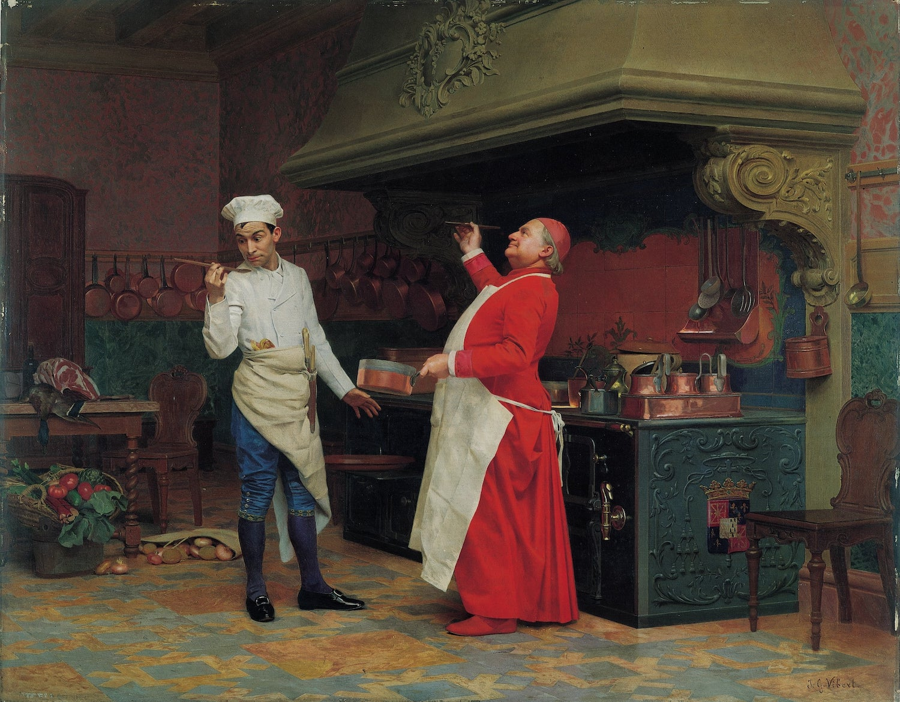

# Кулинария

**Кулинария** — искусство приготовления пищи из продуктов животного, растительного и минерального происхождения в виде различных блюд.

[Перевод терминов с английского](translation-en.md).

## Разное

[↑ Жан Жорж Вибер](https://ru.wikipedia.org/wiki/Вибер,_Жан_Жорж) «Превосходный соус», 1899.

